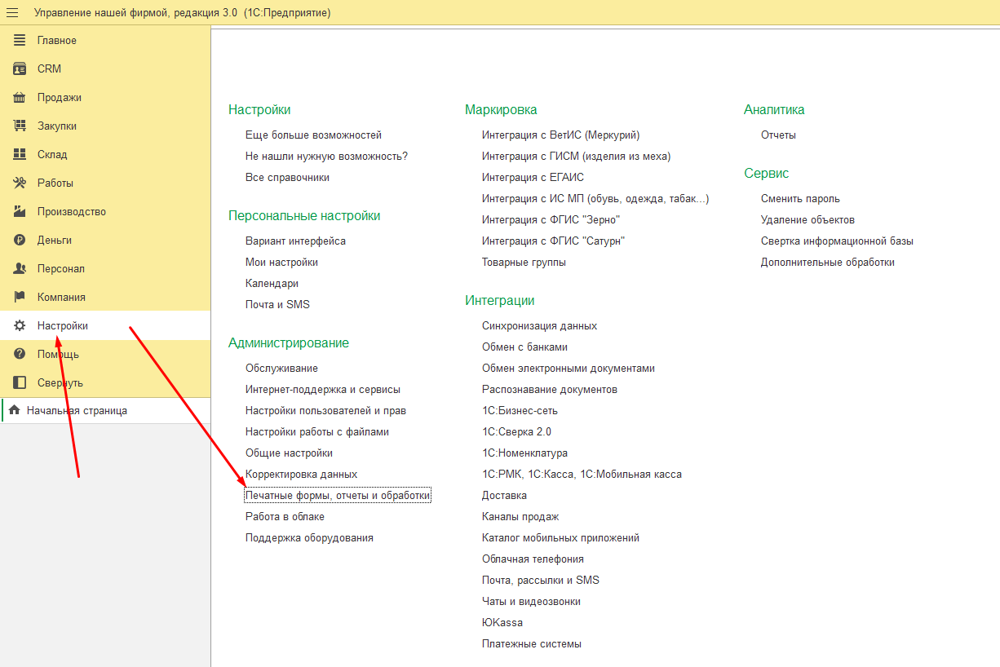
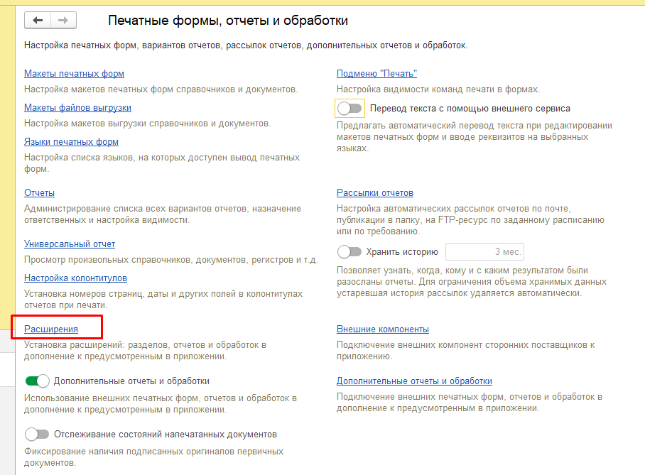
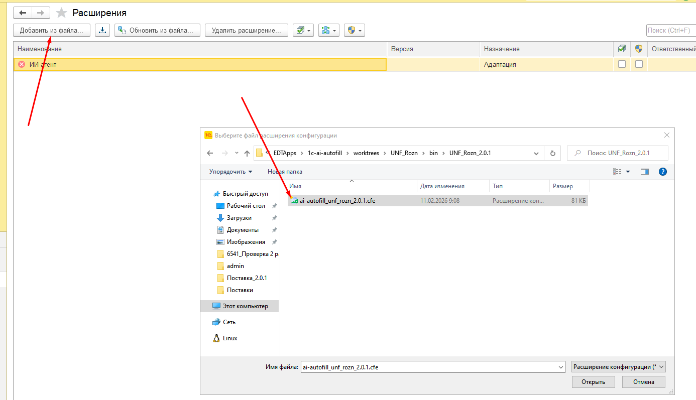
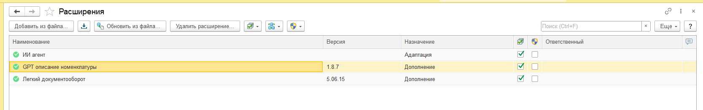
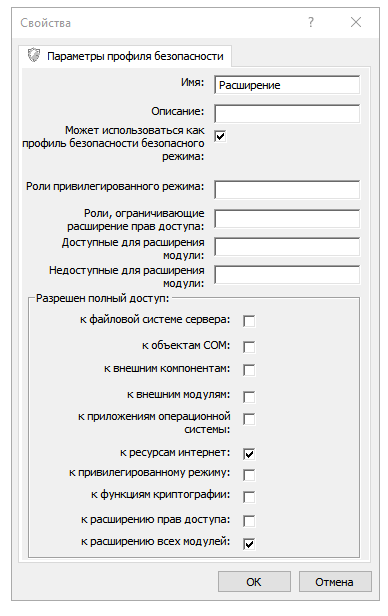
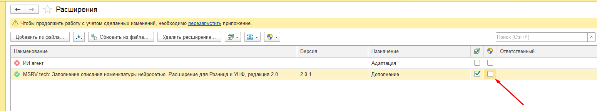
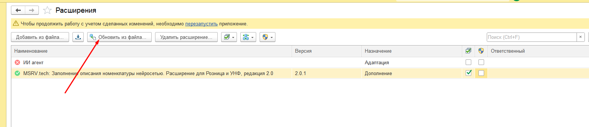
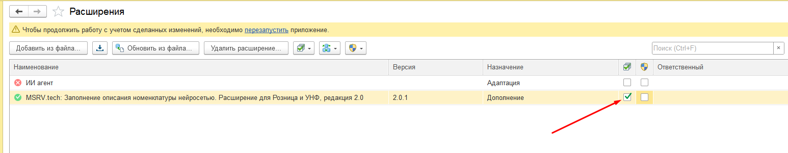
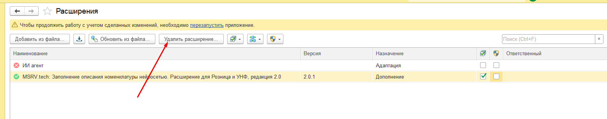
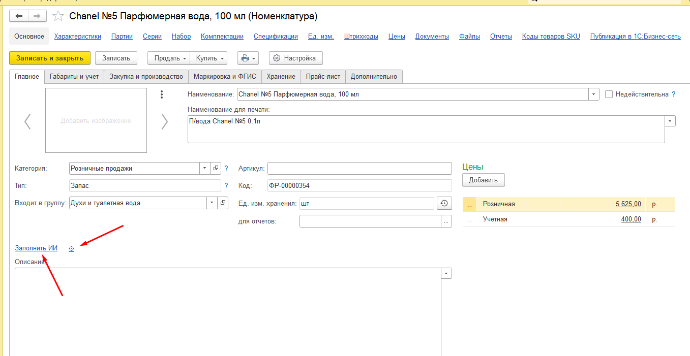

<div class="title-page">

# 1С:Предприятие 8

**«MSRV.tech: Заполнение описания номенклатуры нейросетью. Расширение для 1С:Розница и 1С:УНФ»**

Редакция 2.0

Руководство пользователя

2026 г.

</div>

<div class="copyright-page">

<p class="copyright-header">АВТОРСКИЕ ПРАВА</p>
<p class="copyright-header">НА ПРОГРАММНЫЕ СРЕДСТВА И ДОКУМЕНТАЦИЮ</p>
<p class="copyright-header">ПРИНАДЛЕЖАТ ООО «Манжела». Лицензия MIT</p>

<p class="copyright-agreement">Расширение и документация распространяются по лицензии <strong>MIT</strong>. Вы можете свободно использовать, копировать, изменять и распространять продукт при условии сохранения уведомления об авторских правах и текста лицензии.</p>

<p class="copyright-authors">Группа разработки расширения: Манжела А.В.</p>

<p class="copyright-contact">ООО «Манжела»</p>
<p class="copyright-contact">Сайт: https://msrv.tech</p>
<p class="copyright-contact">Репозиторий: https://gitsell.ru/msrv-tech/1c-ai-autofill</p>
<p class="copyright-contact">GitHub: https://github.com/msrv-tech/1c-ai-autofill</p>

</div>

<div class="consultation-page">

<p class="consultation-title">Линия консультаций</p>

<p>Техническая поддержка и линия консультаций по работе с расширением осуществляется по электронной почте (тикет на <a href="https://gitsell.ru/msrv-tech/1c-ai-autofill">Gitsell</a> или <a href="https://github.com/msrv-tech/1c-ai-autofill/issues">GitHub Issues</a>) в рабочие дни.</p>

<p>Обращаем ваше внимание, что поддержка и линия консультаций по работе с расширением обеспечивается для пользователей с действующей платной подпиской на ИИ‑прокси <a href="https://gitsell.ru">gitsell.ru</a>.</p>

<p><strong>Обращение на линию поддержки по почте: a.manzhela@msrv.tech</strong></p>
<p><strong>При обращении на линию поддержки по электронной почте обязательно указать:</strong></p>
<ol>
<li>ИНН организации</li>
<li>Наименование организации</li>
<li>Информацию о релизе основной конфигурации и установленных расширений из раздела «Конфигурация» окна «О программе», которое открывается из меню в верхней правой панели программы 1С:Предприятие 8.</li>
</ol>
<p>В случае если необходима консультация, подробно опишите свой вопрос.</p>

<p><strong>При возникновении ошибки необходимо в электронном письме:</strong></p>
<ol>
<li>Описать последовательность действий, приводящих к ошибке.</li>
<li>Написать полный текст ошибки или прикрепить скриншот журнала регистрации, показывающий данную ошибку.</li>
<li>Описать, как, по вашему мнению, должна правильно работать программа.</li>
</ol>

<p>Разработчик ООО «Манжела» обеспечивает исправление ошибок, обнаруженных пользователями, в выпусках новых релизов расширения, но не гарантирует исполнения всех замечаний и предложений по развитию функционала расширения.</p>

</div>

<div class="toc-page">

## Оглавление

1. [Введение](#введение)
2. [Взаимодействие с платформой](#1-взаимодействие-с-платформой)
3. [Установка и подключение расширения](#2-установка-и-подключение-расширения)
4. [Обновление расширения](#3-обновление-расширения)
5. [Отключение расширения](#4-отключение-расширения)
6. [Удаление расширения](#5-удаление-расширения)
7. [Регистрация и настройка](#6-регистрация-и-настройка)
8. [Использование](#7-использование)
9. [Примеры работы](#8-примеры-работы)
10. [Решение типовых проблем](#9-решение-типовых-проблем)

</div>

## Введение

### Назначение продукта  
Расширение «MSRV.tech: Заполнение описания номенклатуры нейросетью. Расширение для 1С:Розница и 1С:УНФ» предназначено для автоматической генерации текстовых описаний номенклатуры с помощью нейросетевых моделей (ИИ). Продукт интегрируется с карточкой номенклатуры в конфигурациях 1С:Розница и 1С:УНФ и позволяет сократить ручной ввод описаний товаров для интернет-магазинов, прайс-листов и внутренней документации.

### Основные возможности  
- Заполнение реквизита «Описание» номенклатуры по наименованию и реквизитам товара  
- Автозаполнение дополнительных свойств номенклатуры (характеристики, атрибуты для каталога)  
- Настраиваемые шаблоны промтов (промптов) для разных сценариев генерации  
- Подключение к ИИ-прокси [Gitsell](https://gitsell.ru) с поддержкой множества моделей (Gemini, GigaChat, YandexGPT, OpenAI и др.)  
- Расширение имеет назначение «Дополнение» и не изменяет типовую конфигурацию

### Подход к ведению учёта  
Расширение не влияет на учётные механизмы конфигурации. Операции с номенклатурой, складской учёт, движение товаров и финансовый учёт ведутся по правилам расширяемой типовой конфигурации без изменений. Расширение дополняет только процесс формирования справочной информации (описаний и дополнительных свойств) в карточке номенклатуры.

### Используемые методики  
- Генерация текста выполняется через вызов API нейросетевых моделей по протоколу, совместимому с OpenAI  
- Для описания номенклатуры применяются промты (шаблоны запросов) с подстановкой наименования и свойств  
- Дополнительные свойства заполняются на основе ответа модели в формате JSON  
- Методика допускает подключение различных ИИ-провайдеров и моделей при условии совместимости API

### Модели и принятые допущения  
- Результат генерации зависит от выбранной модели ИИ, параметров запроса и качества исходных данных  
- Точность и полнота описаний не гарантируются; рекомендуется проверка и редактирование сгенерированного текста  
- Для работы расширения требуется платная подписка на ИИ-прокси Gitsell или иной совместимый API-сервис  
- Расширение не хранит историю запросов к ИИ и не обучается на введённых пользователем данных

---

## 1. Взаимодействие с платформой

### 1.1. Программный продукт разработан в среде «1С:Предприятие 8.3»

### 1.2. Требования к ПО  
Требования к версии платформы «1С:Предприятие 8.3» определяются функционалом расширяемой конфигурации. Рекомендуемая версия платформы: не ниже 8.3.24.

### 1.3. Совместимость расширения  
Данная сборка расширения предназначена для конфигураций:
- **1С:Управление нашей фирмой (УНФ)** — редакция 3.0
- **1С:Розница** — редакция 3.0

Расширение имеет назначение «Дополнение» и не требует внесения изменений в типовую конфигурацию.

### 1.4. Выбор версии расширения  
Для установки на УНФ и Розницу используйте сборку **UNF_Rozn** из раздела [Releases](https://github.com/msrv-tech/1c-ai-autofill/releases).

---

## 2. Установка и подключение расширения

### 2.1. Скачивание  
Скачайте файл расширения (формат `.cfe`) сборки **UNF_Rozn**:

- **[Gitsell](https://gitsell.ru/msrv-tech/1c-ai-autofill)** — удобный способ скачивания через витрину репозиториев
- **[GitHub Releases](https://github.com/msrv-tech/1c-ai-autofill/releases)** — альтернативный источник

### 2.2. Подключение расширения  
Для подключения расширения в базу необходимо перейти:

**Настройки → Администрирование → Печатные формы, отчёты и обработки → Расширения**





В форме списка расширений необходимо добавить новое и выбрать скачанный файл формата `.cfe`.





### 2.3. Режимы подключения  
Подключение расширения возможно в двух режимах работы:

#### 2.3.1. С использованием Безопасного режима  
Используйте при работе с профилями безопасности (зависит от политики безопасности вашей организации). В этом режиме требуется дополнительная настройка прав для выполнения HTTP-запросов к API.



#### 2.3.2. Без использования Безопасного режима (рекомендуется)  
После добавления расширения снимите флаг «Безопасный режим» для возможности выполнения запросов к API сервиса Gitsell.



### 2.4. Перезапуск сеанса  
После подключения расширения перезапустите текущий сеанс пользователя.

---

## 3. Обновление расширения

### 3.1. Автоматическая проверка  
Расширение при открытии настроек проверяет доступность новой версии. При наличии обновления отображается соответствующее уведомление с возможностью скачать или установить обновление.

### 3.2. Ручное обновление  
Для обновления расширения в базе необходимо перейти:

**Настройки → Администрирование → Печатные формы, отчёты и обработки → Расширения**

В форме списка установленных расширений выберите «GPT описание номенклатуры» и нажмите кнопку **«Обновить из файла»**.



### 3.3. После обновления  
После выбора файла расширения и успешного обновления перезапустите текущий сеанс пользователя.

---

## 4. Отключение расширения

### 4.1. Условия отключения  
Отключение выполняется пользователем при обнаружении ошибок и невозможности дальнейшего использования. Для отключения расширения необходимы права администратора или полные права.

### 4.2. Процедура отключения  
Для отключения расширения в базе необходимо перейти:

**Настройки → Администрирование → Печатные формы, отчёты и обработки → Расширения**

В форме списка установленных расширений выберите «GPT описание номенклатуры» и снимите крайний левый флаг в списке (флаг использования).



### 4.3. Сохранение данных  
Отключение использования расширения не влечёт изменения данных расширяемой конфигурации. Все данные расширения при этом сохраняются.

---

## 5. Удаление расширения

### 5.1. Процедура удаления  
Удаление расширения выполняется в меню:

**Настройки → Администрирование → Печатные формы, отчёты и обработки → Расширения**

Выберите расширение «GPT описание номенклатуры» и нажмите кнопку удаления.



### 5.2. Последствия удаления  
Удаление расширения не влечёт изменения данных расширяемой типовой конфигурации. Все данные расширения (настройки, токен и т.п.) при этом удаляются.

**Внимание:** удаление расширения не обратимо. Рекомендуется предварительная резервная копия базы.

---

## 6. Регистрация и настройка

### 6.1. Технические требования  
Работу расширения обеспечивает API сервиса [Gitsell](https://gitsell.ru). Для работы расширения необходимо:
- Подключение к интернету
- Регистрация на сервисе Gitsell
- Получение API-токена (авторизация через Device Flow)

Для работы **не требуется VPN**. Поддерживаются различные модели ИИ: Gemini, GigaChat, YandexGPT, OpenAI, Deepseek и другие.

### 6.2. Открытие настроек  
Настройка осуществляется из карточки номенклатуры по ссылке **«Настройки»** (⚙) или через команду **«GPT описание номенклатуры»** в интерфейсе.



### 6.3. Регистрация на Gitsell  
При первом обращении к функции «Заполнить ИИ» расширение предложит пройти регистрацию:

1. Нажмите кнопку **«Зарегистрироваться на Gitsell»** в форме настроек.
2. Откроется форма регистрации. Нажмите кнопку **«Регистрация»**.
3. В браузере откроется страница Gitsell. Войдите в свой аккаунт или создайте новый.
4. Подтвердите авторизацию приложения.
5. После успешной авторизации токен сохранится автоматически, промты по умолчанию будут заполнены, форма регистрации закроется.


### 6.4. Настройка параметров  
В форме настроек укажите:

| Параметр | Описание |
|----------|----------|
| **Адрес сервера** | Адрес провайдера, совместимого с OpenAI API. При использовании Gitsell после регистрации автоматически подставляются `https://gitsell.ru/api` и API key |
| **Модель ИИ** | Выберите модель из списка (Gemini, GigaChat, YandexGPT, OpenAI, auto и др.) |
| **Промт (описание)** | Шаблон запроса для генерации описания. Обязательный плейсхолдер: `{Наименование}` |
| **Промт (доп. свойства)** | Шаблон для автозаполнения дополнительных свойств. Обязательные плейсхолдеры: `{Наименование}`, `{Свойства}` |


### 6.5. Шаблоны промтов по умолчанию  

**Для описания товара:**
```
Создай подробное продающее описание товара "{Наименование}" для интернет-магазина. Описание должно быть информативным, привлекательным для покупателей и содержать ключевые характеристики.
```

**Для дополнительных свойств:**
```
Для товара "{Наименование}" определи значения следующих свойств: {Свойства}. Ответ верни строго в формате JSON, где ключи — это имена свойств, а значения — их значения. Если не знаешь значение — не включай свойство в JSON.
```

### 6.6. Настройка прав для пользователей с ограниченными правами  
Для пользователей с ограниченными правами необходимо создать новый профиль и добавить в этот профиль роль **GPT_ОсновнаяРоль**, поставляемую с расширением.

### 6.7. Автозаполнение дополнительных реквизитов  
В настройках можно включить и настроить автозаполнение дополнительных реквизитов и характеристик номенклатуры. Выберите нужные свойства из списка — они будут передаваться в промт и заполняться по результату запроса к ИИ.

---

## 7. Использование

### 7.1. Элементы интерфейса в карточке номенклатуры  
В карточке номенклатуры появятся ссылки:
- **«Заполнить ИИ»** — генерирует описание товара и заполняет дополнительные свойства на основе наименования
- **«Настройки»** (⚙) — открывает форму настроек расширения

*См. скриншот в п. 6.2.*

### 7.2. Процесс генерации описания  
1. Откройте карточку номенклатуры.
2. Убедитесь, что заполнено наименование товара.
3. Нажмите ссылку **«Заполнить ИИ»**.
4. При первом запуске при необходимости откроется форма регистрации на Gitsell.
5. Дождитесь завершения операции (отображается окно ожидания).
6. Сгенерированное описание будет занесено в поле «Комментарий» (в УНФ/Рознице).
7. Настроенные дополнительные свойства заполнятся автоматически (если промт и список свойств настроены).

### 7.3. Поля для описания  
В конфигурациях УНФ и Розница описание записывается в поле «Комментарий».

### 7.4. Сохранение изменений  
После генерации форма становится модифицированной. Для сохранения данных нажмите кнопку **«Записать»** в форме элемента.

---

## 8. Примеры работы

### 8.1. Пример 1  
**Запрос:** «Автошина Cordiant Road Runner 195/65R15 91H»

**Ответ:** «Автошина Cordiant Road Runner 195/65R15 91H — надежный выбор для тех, кто ценит комфорт и безопасность на дороге. Ее высокотехнологичный дизайн исключает скольжение на мокрой поверхности и обеспечивает стабильность при движении на трассе...»

### 8.2. Пример 2  
**Запрос:** «Ведро с отжимом»

**Ответ:** «Обновите свой домашний инвентарь с нашим беспроигрышным ведром с отжимом! Идеальное решение для уборки дома, на даче или в любом домашнем хозяйстве...»

### 8.3. Пример 3  
**Запрос:** «Chanel №5 Парфюмерная вода, 100 мл»

**Ответ:** «Chanel №5 — это непревзойденный аромат, который известен своей богатой историей и безупречным качеством. Эта парфюмерная вода создана легендарным дизайнером Коко Шанель...»

---

## 9. Решение типовых проблем

### 9.1. Ошибка «Не заполнен адрес сервера в настройках GPT»  
Выполните регистрацию на Gitsell — при успешной авторизации адрес `https://gitsell.ru/api` и API key заполнятся автоматически. Либо укажите адрес другого провайдера, совместимого с OpenAI API.

### 9.2. Ошибка при первом нажатии «Заполнить ИИ»  
Расширение не настроено. Откройте настройки по ссылке ⚙ и выполните регистрацию на Gitsell, укажите адрес сервера и выберите модель.

### 9.3. Ошибка в промте «отсутствует плейсхолдер»  
Убедитесь, что в промте для описания присутствует `{Наименование}`, а в промте для доп. свойств — `{Наименование}` и `{Свойства}`.

### 9.4. Дополнительные свойства не заполняются  
Проверьте, что в настройках выбран хотя бы один дополнительный реквизит или характеристика для автозаполнения.

### 9.5. Ошибки при работе в Безопасном режиме  
Если используете Безопасный режим, убедитесь, что роль содержит права на выполнение HTTP-запросов к внешним ресурсам. Рекомендуется снять флаг «Безопасный режим» для расширения.

---

*Документ подготовлен для конвертации в PDF. Для печати используйте формат А4.*

*Приложение: [README](readme.txt), [Releases](https://github.com/msrv-tech/1c-ai-autofill/releases), [Gitsell](https://gitsell.ru/msrv-tech/1c-ai-autofill)*
